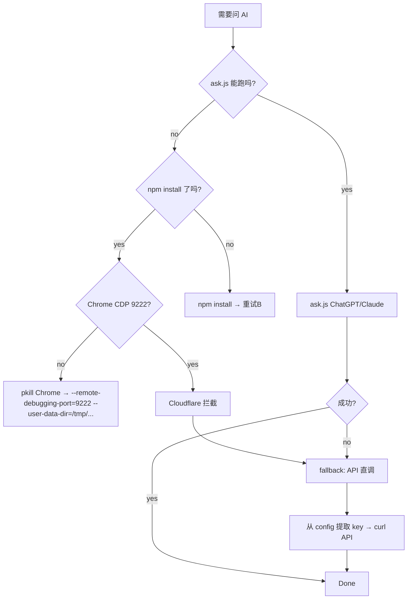

# CDP 操作坑与 Workaround（macOS）

## TL;DR

```
ask.js <provider> "prompt"  → 需要 Chrome CDP (port 9222) + node_modules
browser_navigate(url)       → 走 Hermes Browserbase（云端），底层是 headless Chromium，易触发 Cloudflare
电脑用(computer_use)         → 需要 CUA driver 安装
```

三条路各有各的坑。别在一条路上死磕，知道 fallback 顺序。

---

## 方案A：ask.js（本地 CDP）

### 前提

```bash
# 1. Playwright 依赖
cd ~/.hermes/skills/web-ai-cdp-bridge/scripts/
npm install                    # 安装 playwright-core 等依赖

# 2. Chrome 以远程调试模式启动
/Applications/Google\ Chrome.app/Contents/MacOS/Google\ Chrome \
  --remote-debugging-port=9222 \
  --no-first-run \
  --user-data-dir=/tmp/chrome_cdp_$$ &

# 3. 确认端口
sleep 3
curl -s http://127.0.0.1:9222/json/version | python3 -c "import sys,json; print(json.load(sys.stdin)['Browser'])"

# 4. 执行
node ask.js chatgpt "你的问题"
node ask.js claude "你的问题"
```

### 已知问题

| 问题 | 原因 | Workaround |
|------|------|------------|
| `connect ECONNREFUSED 127.0.0.1:9222` | Chrome 没起 CDP | `--remote-debugging-port=9222` 参数确认；等 3-5 秒让 Chrome 初始化 |
| `Cannot find module 'ask.js'` | 启动目录不对 | `cd scripts/` 再执行，不是 `cd web-ai-cdp-bridge/` |
| Chrome 起了但 9222 不监听 | --user-data-dir 被旧实例锁住；macOS 沙箱阻止绑定 | 杀所有 Chrome：pkill -f, 用全新临时目录 --user-data-dir=/tmp/chrome_cdp_$(date +%s)；确认 lsof -i :9222 有输出 |
| Cloudflare 挑战（Just a moment...） | 本地 CDP 也触发 CF 风控 | 切到方案B 或方案C |
| `npm install` 超时 | 国内 npm 慢/代理问题 | 用淘宝镜像：`npm config set registry https://registry.npmmirror.com` |
| canvas 缺失 | 无头模式渲染限制 | 不影响文本类 AI 对话，仅影响截图/OCR 需求 |

### macOS 特有：--user-data-dir 的坑

多个 Chrome 实例共用默认 `~/Library/Application Support/Google/Chrome` 会导致锁冲突。
**一定要每次起临时目录**：
```bash
--user-data-dir=/tmp/chrome_cdp_$(date +%s)
```

---

## 方案B：Hermes browser_navigate（云浏览器）

通过 Hermes 内置的 Browserbase 后端，不需要本地 Chrome。

```python
browser_navigate(url="https://chatgpt.com")
browser_snapshot(full=True)     # 看页面内容
browser_type(ref="@e3", text="prompt")  # 填输入框
browser_click(ref="@e5")        # 点发送
```

### 已知问题

| 问题 | 原因 | Workaround |
|------|------|------------|
| "Just a moment..." | Cloudflare 检测到 datacenter IP 触发 JS 挑战 | 无解。Browserbase 免费层 IP 信誉低 |
| 空页面 snapshot | 页面被 CF 拦截后 DOM 为空 | 同上了，不是登录态问题 |
| 登录态不存在 | 云浏览器没有你的 Cookie | 需要人工扫码/登录一次；但 CF 这关过了也白搭 |

**结论**：Hermes 内置 browser 适合不需要反爬的网站。遇到 CF 保护的网站（ChatGPT、Claude）就走不通。

---

## 方案C：AI API 直接调用（最可靠 fallback）

当方案A/B 皆失败时，用已有的 API key 通过 curl 直接调 AI。

### 前提：找到可用的 API key + endpoint

```bash
# 从 Hermes 配置找 key
grep "api_key:" ~/.hermes/config.yaml | grep -v '\${'

# 从 key 的上下文确定 base_url
grep -B3 "api_key: sk-" ~/.hermes/config.yaml | grep "base_url"
```

### 已知可用通道

| endpoint | key 前缀 | 模型 | 状态 |
|----------|---------|------|------|
| `https://api.xhahlf.top/v1` | `sk-xxx` | `grok-4.5` | ✅ 通（2026-07-16 确认） |
| `https://open.bigmodel.cn` | `9efba...` | 智谱系列 | ⚠️ 需要正确 endpoint path |

### 调用模板

```bash
API_KEY="sk-your-key-here"
ENDPOINT="https://api.xhahlf.top/v1/chat/completions"

curl -s --max-time 90 -x http://127.0.0.1:10808 "$ENDPOINT" \
  -H "Content-Type: application/json" \
  -H "Authorization: Bearer $API_KEY" \
  -d '{
    "model": "grok-4.5",
    "messages": [{"role": "user", "content": "你的问题"}],
    "max_tokens": 2000
  }' | python3 -c "import sys,json; d=json.load(sys.stdin); print(d['choices'][0]['message']['content'])"
```

---

## 决策树



## 待完善

- [ ] `npm install` 在 web-ai-cdp-bridge/scripts/ 下执行（当前 node_modules 空）
- [ ] Chrome CDP macOS 自动化启动脚本
- [ ] 多 API 通道健康检查 (health check cron?)
