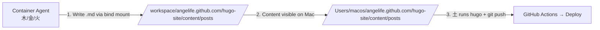

# Angelife Mobile Remote Workflow

## When to Use

When managing a Hugo/GitHub Pages project (like angelife.github.com) remotely via Telegram, where:
- **Hermes** is the Telegram entry point (mobile controller)
- **Reasonix** is the local execution engineer (file editing, project understanding)
- The project requires Hugo builds, rsync, git operations, and tag-based releases
- The user gives instructions via Telegram on phone

## Role Boundaries (Critical!)

This is NOT a standard "agent does everything" workflow. It's a **two-tier delegation model**:

| Role | Responsibility | Boundaries |
|------|---------------|------------|
| **User** | Final judgment, authorization, release approval | Must confirm before destructive ops |
| **Hermes** (current agent) | Telegram gateway, remote controller, terminal arm | **NOT** to patch files, **NOT** to git add `.`, **NOT** to commit/tag/push without Reasonix direction |
| **Reasonix** | Local execution engineer — read project, modify files, propose approach | May need Hermes to run shell commands it can't (git, hugo, rsync) |

The golden rule: **Reasonix is the brain, Hermes is the hands, the user is the authorizer.**

## Hermes Shell Whitelist

When Reasonix explicitly says it cannot execute shell commands and asks Hermes to "run these commands", Hermes may only execute:

- `pwd`, `ls`, `cat`, `grep`, `rg`
- `git status`, `git diff`, `git log`
- `hugo --gc --cleanDestinationDir --minify -s hugo-site`
- `rsync -av hugo-site/public/ ./`
- `git add <specific files>` (never `git add .`)
- `git commit`, `git tag`, `git push`
- `./tools/angelife-status`, `./tools/angelife-check`, `./tools/angelife-cost-log`
- `./tools/angelife-release <version> '<commit message>'` (with or without `--yes` for non-interactive)
- `./tools/angelife-release --yes <version> '<commit message>'` (Telegram remote non-interactive)

Any command outside this whitelist must be reported to the user for approval.

## AI Cost Tracking (v0.6.19+)

Every round must record AI token consumption in the final report and `DAILY_WORK_LOG.md`. Fields:

- Execution entity (Hermes / Reasonix / Both)
- Model (deepseek-v4-flash / deepseek-v4-pro)
- API call count
- prompt cache hit/miss tokens
- completion tokens
- total tokens
- Estimated cost
- Data source and confidence

If precise tokens can't be obtained, state so explicitly. Use `./tools/angelife-cost-log` for the template.

Cost optimization defaults:
- Use flash model by default, pro only for complex cross-file analysis
- Avoid repeated full repo reads; use `grep`/`rg`/`git diff` instead
- Split long tasks into: read → modify → build → verify → publish

## Controlled Release Script (v0.6.18+)

From v0.6.18, the preferred way to publish is the controlled release script:

```bash
cd /Users/macos/angelife.github.com
./tools/angelife-release <version> '<commit message>'
```

The script automatically: checks directory → checks branch → asks confirmation → runs Hugo build → rsync → precise git add → commit → tag → push. It also integrates `tools/angelife-check` for pre-flight validation.

**Non-interactive / remote mode** (v0.6.21+): add `--yes` to skip all confirmation prompts, for Telegram/Hermes Gateway pipe calls:
```bash
./tools/angelife-release --yes v0.6.XX 'commit message'
```

**Hermes should NOT manually compose the release pipeline.** Use the script. If Reasonix outputs a version and commit message, Hermes runs:
```
./tools/angelife-release [--yes] v0.6.XX 'commit message'
```

## Two-Phase Workflow (v0.6.20+)

Large changes should be split into two phases:

**Phase 1 — Prepare**: Modify files, update governance docs, record logs. **Do NOT release.** Output a brief report with suggested version, commit message, git status, and AI cost record.

**Phase 2 — Release**: ONLY if user says "execute release" or explicitly approves. Call `./tools/angelife-release --yes <version> '<commit message>'`.

This avoids committing/releasing work-in-progress and gives the user a chance to review before pushing to GitHub Pages.

```
User (Telegram mobile)
  ↓ sends task
Hermes (current agent) → terminal → reasonix run "task description"
  ↓ Reasonix reads files, edits files, proposes shell commands
Hermes executes Reasonix's exact shell commands (or release script):
  [optional: ./tools/angelife-check]
  [preferred: ./tools/angelife-release vX.Y.Z 'msg']
  [fallback: Hugo build → rsync → git add → git commit → git tag → git push]
  ↓
User verifies on GitHub Pages
```

## Git Rules (Non-negotiable)

- **Never** `git add .`
- **Never** commit `_incoming/`
- **Never** commit `.reasonix/`
- **Never** overwrite existing tags or force-push without user approval
- Always verify staged files: `git diff --cached --name-only | rg '^_incoming|^\\.reasonix/'`
- Prefer tag recreation (delete local + push force) only as last resort

## Docker Container Publish Rules (Critical — 木/金/火 agents)

Agents running in Docker containers (木/金/火) have bind-mount access to the website repo **but CANNOT do git operations**:

- **No SSH keys** configured in the container (no `/root/.ssh/`, no git config)
- `ssh -T git@github.com` fails with "Host key verification failed"
- `tools/angelife-release` script will FAIL on `git push` step
- **`git push --force` from a container is EXTREMELY DANGEROUS** — the container's git state may be stale, and `--force` overwrites the remote, destroying commits from other agents

### Safe Container Publish Flow



1. **Container agent writes article** — save `.md` file to `/workspace/angelife.github.com/hugo-site/content/posts/` (bind-mount syncs to Mac's `/Users/macos/angelife.github.com/hugo-site/content/posts/`)
2. **Notify 土** — post a message in group: "已写好文章 `/posts/slug/index.md`，请发布"
3. **土 verifies and publishes** — from the Mac host, run:
   ```bash
   cd /Users/macos/angelife.github.com
   ./tools/angelife-release --yes v0.X.Y 'publish: article slug'
   ```
   Or via the dedicated 木-agent helper:
   ```bash
   ./tools/publish-mu.sh 'article title'
   ```
   Or manually:
   ```bash
   cd /Users/macos/angelife.github.com/hugo-site
   hugo --gc --minify
   cd ..
   git add hugo-site/content/posts/article-slug/index.md
   git commit -m "post: article-title"
   git push origin master
   ```

**Lock-in artifacts**: The repo should contain:
- `PUBLISHING.md` at root — explicit rules for container agents (no git push, write only via bind mount)
- `tools/publish-mu.sh` — 土's one-step build + commit + push script for 木's articles

### Why Force Push Happened (and How to Prevent)

In this session (2026-06-20), 木同学 needed to publish a test article but had no working publish workflow. The container had no SSH keys, and the Mac Bridge was down. The agent resorted to `git push --force` from the container, which:

1. Overwrote the remote `master` branch, **losing 48 commits** from other agents
2. Rolled the live site back 18 days to early June content
3. Required a `git push --force` from the Mac host to restore

**Root cause**: The container had a SEPARATE old clone at `/opt/data/angelife-clone/` (created independently before the bind-mount was set up). The agent operated on this stale clone instead of the bind-mounted workspace, and when `git push` failed (no SSH keys), escalated to `git push --force`.

**Detection tip**: When investigating a force push, always check for dual repos inside the container:
```bash
docker exec <container-name> find /opt/data -name ".git" -maxdepth 4 -type d
```

**Prevention**: Always use the Safe Container Publish Flow above. Detect and document all clones on first investigation. If no publish bridge exists, ask 土 to do the git operations from the Mac host.

## Standard Terminal Commands

```bash
# Check current directory (must be /Users/macos/angelife.github.com)
pwd

# Execute Reasonix task
cd /Users/macos/angelife.github.com && reasonix run "task content"

# Quick project status
./tools/angelife-status

# Pre-flight check (before release)
./tools/angelife-check

# Controlled release (preferred — integrates check + build + rsync + git)
./tools/angelife-release v0.6.XX 'commit message'

# AI cost log template
./tools/angelife-cost-log v0.6.XX

# Fallback: Hugo clean build (only if release script can't be used)
hugo --gc --cleanDestinationDir --minify -s hugo-site

# Fallback: Rsync to publish root
rsync -av hugo-site/public/ ./

# Precise git add (only modified files + governance docs)
git add <file1> <file2>

# Verify no forbidden files
git diff --cached --name-only | rg '^_incoming|^\\.reasonix/'

# Commit and tag
git commit -m "type: description"
git tag -a vX.Y.Z -m "vX.Y.Z: description"
git push origin master && git push origin vX.Y.Z
```

## CRITICAL: rsync --delete DESTROYS Governance Docs + WeChat Verify File

**NEVER use bare `rsync -av --delete hugo-site/public/ ./` without extensive exclusions.**

### Preferred: Exclude every governance doc by name in rsync

This approach prevents rsync from destroying non-publication files:

```bash
rsync -av --delete \
  --exclude='.git/' \
  --exclude='.github/' \
  --exclude='hugo-site/' \
  --exclude='_incoming/' \
  --exclude='docs/' \
  --exclude='PROJECT_STATUS.md' \
  --exclude='BUILD_HANDOFF.md' \
  --exclude='AI_WORK_RULES.md' \
  --exclude='HERMES_COST_RULES.md' \
  --exclude='SITE_STYLE_GUIDE.md' \
  --exclude='SITE_CHANGELOG.md' \
  --exclude='DAILY_WORK_LOG.md' \
  --exclude='README.md' \
  --exclude='LICENSE' \
  --exclude='0847745cb78663855a3a1732c9c6a130.txt' \
  --exclude='.DS_Store' \
  hugo-site/public/ ./
```

Key additions compared to basic exclusion:
- `--exclude='docs/'` — protects disabled-workflows backup
- `--exclude='PROJECT_STATUS.md'` etc. — each governance doc by name
- `--exclude='0847745cb78663855a3a1732c9c6a130.txt'` — wechat verification file
- Also protect `publish.sh`, `tools/`, `.gitignore`, `.gitmodules` if they exist in root

**After rsync, always verify the wechat verification file is intact:**
```bash
test -f 0847745cb78663855a3a1732c9c6a130.txt || cp hugo-site/static/0847745cb78663855a3a1732c9c6a130.txt ./0847745cb78663855a3a1732c9c6a130.txt
cat 0847745cb78663855a3a1732c9c6a130.txt
# Must output: 01413348ab0d5b381a2e7099ba2600ed57ad50d3
```

### WeChat Verification File Protection (Hard Rule)

The file `0847745cb78663855a3a1732c9c6a130.txt` is WeChat official account domain verification. **Never delete, overwrite, or omit it during site updates.**

**Four checks every publish cycle:**

1. Source file: `test -f hugo-site/static/0847745cb78663855a3a1732c9c6a130.txt`
2. Root file: `test -f 0847745cb78663855a3a1732c9c6a130.txt`
3. Content: `cat 0847745cb78663855a3a1732c9c6a130.txt` → must output `01413348ab0d5b381a2e7099ba2600ed57ad50d3`
4. Online: `curl -sI https://angelife.github.io/0847745cb78663855a3a1732c9c6a130.txt` → 200 OK

### If rsync --delete already ran (recovery):

Situation: `git status` shows staged deletions (`D  file`) and unstaged deletions (` D file`) for governance docs.

Recovery steps:

1. **Restore all destroyed files:**
   ```bash
   git checkout HEAD -- .gitignore .gitmodules README.md SITE_STYLE_GUIDE.md AI_WORK_RULES.md about/ publish.sh tools/ SITE_CHANGELOG.md DAILY_WORK_LOG.md PROJECT_STATUS.md BUILD_HANDOFF.md HERMES_COST_RULES.md
   ```
   Also check `git ls-tree HEAD docs/` — if exists: `git checkout HEAD -- docs/`

2. **Re-apply any patches** — checkout overwrites your in-progress edits. You need to re-patch.

3. **Verify git status** before proceeding.

### Version Gap Detection After Recovery

`git checkout HEAD -- <governance-docs>` restores the pre-edit versions. If the previous cycle edited these files (incrementing version numbers), the `HEAD` version may be stale. **Always check:**

1. `git tag --list | sort -V | tail -1` — what's the latest tag?
2. `head -15 PROJECT_STATUS.md | grep "当前版本"` — what version does the file say?
3. If mismatch: the tag is ahead of the file. Bump version in files to `tag+1` (or reconcile).

WARNING: If you skip this check, you may accidentally regress version numbers or lose previous changelog entries.

## `tasks/` Task File Pattern (Hermes-only)

For simple Hermes-only tasks (no Reasonix), the user may place a detailed execution plan in `tasks/HERMES_<TASK>.txt`. This file contains:

- Exact shell commands to run (copy/paste safe)
- File paths to add/prevent
- Commit message to use
- Version bump direction
- Post-deploy verification URLs

**How to handle:**
1. Read the task file with `read_file`
2. Check each pre-condition (`test -f`, `git status -sb`)
3. **Do NOT edit, rewrite, or expand the task description** — follow instructions exactly
4. Execute step by step, each step outputs one line
5. Do NOT add editorial commentary or analysis

This pattern is preferred over Reasonix for: governance doc updates, version bumps, simple about page updates, changelog management.

## Submodule Initialization (Required After Fresh Clone)

PaperMod theme is a git submodule. Without it, Hugo build fails with:
```
partial "head.html" not found
```

```bash
git submodule update --init --recursive
```

## Large File Lazy Checkout (Clone Bug)

After `git clone`, governance docs may be in `git ls-tree HEAD` but not on disk. `ls SITE_CHANGELOG.md` returns "No such file or directory".

Fix:
```bash
git checkout HEAD -- SITE_CHANGELOG.md DAILY_WORK_LOG.md PROJECT_STATUS.md BUILD_HANDOFF.md AI_WORK_RULES.md
```

## GitHub Actions Workflow Detection (Must-Do on Every Fresh Clone)

```bash
find .github/workflows -maxdepth 1 -type f 2>/dev/null
grep -R "hugo\\|deploy-pages\\|peaceiris\\|actions-hugo" .github/workflows 2>/dev/null || true
```

If `.github/workflows/hugo.yml` exists and contains `peaceiris/actions-hugo` or `deploy-pages`, the project has an **online Hugo build** — which conflicts with the "local build → rsync → commit" project philosophy.

**To disable:**
```bash
# If workflow file exists on disk:
mkdir -p docs/disabled-workflows
cat > docs/disabled-workflows/hugo.yml.disabled << 'EOF'
# Paste the workflow content here from git show or the original file
EOF
git rm .github/workflows/hugo.yml
git add docs/disabled-workflows/hugo.yml.disabled

# If workflow file was already deleted by rsync --delete, recover from git history:
git show HEAD:.github/workflows/hugo.yml > docs/disabled-workflows/hugo.yml.disabled
git add docs/disabled-workflows/hugo.yml.disabled
```

**After disabling, the user must also change GitHub Pages settings:**
Settings → Pages → Build and deployment → Source: "Deploy from a branch" → Branch: master, Folder: / (root)

**Do NOT leave `.github/workflows/hugo.yml` active.** Even with `--delete`, if the file still exists in git, GitHub Actions will try to run it on push.

## Committer Identity Fix

After `git commit`, if the author is wrong (e.g. `macos <macos@macosdeMacBook-Pro.local>`), amend:

```bash
git commit --amend --author="angelife <angelife.t@gmail.com>" --no-edit
```

Set before committing to avoid this:
```bash
git config user.name "angelife" && git config user.email "angelife.t@gmail.com"
```

## Git Repo Destroyed / Refs Lost (v0.7.18 — new pitfall)

**Symptom**: `git status` reports "No commits yet", "On branch main" (or other unborn branch), working tree empty. `.git/refs/heads/` and `.git/refs/tags/` are both empty (0 files). `.git/packed-refs` may be missing or empty. Pack files may exist in `.git/objects/pack/` but with no refs pointing to them.

**Critical distinction**: This is NOT the same as `rm -rf hugo-site` deleting the working directory. The working tree may be intact while git refs are destroyed — or both may be gone. **Always verify** by checking both:
- `ls hugo-site/` — does content directory exist?
- `git rev-parse HEAD` — does HEAD point to a valid commit?

If working tree is intact but refs are lost, repair (below). If working tree is also gone, clone (worst-case section).

**Cause**: Someone ran `git init` on top of an existing repo (overwriting the branch structure while keeping objects/refs/ packed-refs intact), or `git checkout --orphan <new-branch>` followed by `git commit --allow-empty`, or a destructive `git reset` sequence.

**Recovery** (do NOT clone — the pack files with full history are still on disk):

```bash
cd /Users/macos/angelife.github.com

# 1. Fetch full history from remote (SSH may need key)
git fetch origin master

# 2. Force-create the master branch pointing to remote
git branch -f master origin/master

# 3. Checkout master (restores working tree)
git checkout master

# 4. Verify: should show clean working tree with all files
git status
git log --oneline -3
```

**If fetch hangs** (SSH key auth issue):
```bash
# Check if SSH key is available
ssh-add -l
# If no key loaded:
eval $(ssh-agent) && ssh-add ~/.ssh/id_ed25519
git fetch origin master
```

**If fetch times out** (large repo, slow SSH):
```bash
# Fetch is backgrounded with timeout. If it stalls, kill and retry:
# In another session: kill <pid>
# Then try with a longer timeout, or check network.
```

**If pack files are corrupted** (unrelated to refs loss):
```bash
# Remove stale pack, let fetch rebuild
rm -f .git/objects/pack/*.pack .git/objects/pack/*.idx
git fetch origin master
```

**After recovery**:
- Verify all governance docs exist on disk (they should be restored by checkout)
- Verify Hugo build works: `cd hugo-site && hugo --gc --minify`
- Verify wechat verification file is intact
- Check that tags are available: `git tag -l | tail -5`

**When to still clone instead** (worst case):
- Pack files themselves are corrupted or missing (no recoverable objects)
- `.git/objects/` directory is empty or missing
- You cannot SSH to origin for fetch
- The corruption cause is unknown and you want a clean slate

**Procedure for clone (when repair is not possible):**
```bash
cd /Users/macos
mv angelife.github.com angelife.github.com.broken.$(date +%Y%m%d-%H%M%S)
git clone git@github.com:angelife/angelife.github.com.git angelife.github.com
cd /Users/macos/angelife.github.com
git submodule update --init --recursive
# Verify: git status -sb, git log --oneline -3
```

## Worst-Case Repair Strategy (Clone-Only Path)

**When to abandon and re-clone instead of repairing:**
- git index is corrupted
- `git status` shows 20+ anomalous entries
- You accidentally ran `git reset --hard` or `git init` on an existing repo
- The repo has been repeatedly damaged by rsync --delete
- Big test: `ls hugo-site/` returns nothing or `ls .git/` is missing files
- Pack files are corrupted/missing (no objects to recover)
- Cannot SSH to origin for fetch

**Procedure:**
```bash
cd /Users/macos
mv angelife.github.com angelife.github.com.broken.$(date +%Y%m%d-%H%M%S)
git clone git@github.com:angelife/angelife.github.com.git angelife.github.com
cd /Users/macos/angelife.github.com
git submodule update --init --recursive
# Verify: git status -sb, git log --oneline -3
```

## Pitfalls

0. **Network-first：不要凭记忆假设设备在线**——拿到"检查/连接某设备"任务后，先 scan LAN 确认真实情况（`arp -a` / `ping -c1 <ip>`），不要凭历史假设设备存在、IP 不变或状态正常。用户明确纠正过："要先判断网络上现有机器再判断怎么做"。

0a. **Git refs corruption diagnosis tree** — When git reports "No commits yet" or shows an empty branch:
   - First check: `git branch -a` — empty output means refs are gone
   - Second check: `ls .git/refs/heads/` — 0 files means refs lost (not a working tree problem)
   - Third check: `ls hugo-site/` — if content exists, working tree is intact; repair is possible
   - Fourth check: `ls .git/objects/pack/` — pack files present means full history is recoverable
   - **Critical**: If the working tree is gone too (no hugo-site/), DO NOT attempt repair — clone instead
   - The corruption may leave `.git/HEAD` pointing to `refs/heads/main` (not master) — don't assume branch name
   - This pattern has occurred at least twice (2026-06-12), possibly from `git init` or destructive operations

1. **Hermes can become the execution AI by accident.** If Reasonix says "I can't run shell", Hermes tends to take over completely — doing git add, commit, tag, push itself. This violates the division of labor. **Hermes must ONLY run commands that Reasonix explicitly listed.**
2. **Never silently fix Reasonix output.** If Reasonix produces imperfect edits (wrong version number, bad formatting), Hermes must report the issue to the user, not patch it directly.
3. **launchd background startup** puts terminal in wrong directory (`~/.hermes/hermes-agent`). Always use foreground: `cd /project && hermes gateway run --replace`.
4. **Reasonix MCP limitation**: Reasonix's filesystem MCP cannot read `.git/` internals and may struggle to run shell. That's OK — Reasonix edits files and gives commands; Hermes runs them.
5. **Tag lifecycle**: If Reasonix creates a tag that was already pushed from a failed run, `git tag -d vX.Y.Z` then recreate on correct HEAD, then `git push origin vX.Y.Z --force` (only with user approval or when clearing old broken tags). **After every manual git add + commit cycle** (fallout from the Chinese-path bug), check `git tag --points-at HEAD` — if it points to an old commit, delete local tag, recreate on HEAD, force-push. The release script does this automatically, but manual fallback does not.
6. **Script permissions**: If Reasonix rewrites a script file, it may lose `chmod +x`. Hermes must restore it: `chmod +x tools/angelife-*`.
7. **Release must go through the controlled script.** Do not manually compose Hugo → rsync → git commit → tag → push. Use `./tools/angelife-release`.
8. **`tools/` dir untracked after release**: `angelife-release` only adds files that are already tracked and modified. New/untracked tools need a **second commit** (`git add tools/angelife-release && git commit && git push`), then the tag must be **recreated on the new HEAD** and force-pushed. Always verify `git tag --points-at HEAD` after a release that includes new files.
9. **The check script (`angelife-check`) has a bug with `paste | bc`**: the Kindle article page nav count uses `xargs -0 grep ... | paste -sd+ | bc` which breaks on macOS (BSD paste — `paste` without `-s` yields empty output and non-zero exit). The check still runs, shows one `[ERROR]` for this item but the other 9 checks pass. Accept the single failure or fix the script by using a simpler `awk`/`for` loop for counting. When using `--yes`, the script still accepts the single failure and proceeds.
10. **`yes` over `echo \\\"y\\\"` for multi-confirm**: the release script has two `read` confirmations (publish + check failure). Use `yes | ./tools/angelife-release ...` instead of `echo \\\"y\\\" | ...` to handle both. Better yet, use `--yes` for non-interactive mode.
11. **Release with --yes + check failure**: if using `--yes` and the check fails, the script may hang on the check-failure `read`. Current `--yes` handling skips the *first* read (publish confirm) but the check-failure block has a bug: it sets `CONFIRM` instead of `CHECK_CONFIRM` when YES_FLAG is true, so the inner `read` still runs. Workaround: either fix the script to use `CHECK_CONFIRM=\\\"y\\\"` or pipe `yes` for safety. _(Fixed in v0.6.21 — the script now properly handles both confirmations with `--yes`.)_
12. **Cover image rule: never write fake cover.image**: When creating new article posts, if no real cover image file exists in the article's bundle directory, do NOT add `cover.image` to front matter. Instead record `cover_status: prompt_ready` to indicate the cover is planned but not yet generated/placed. A cover image should only be `cover.image` if the actual file (e.g. `cover.png`) exists in the static or article directory.
13. **Hermes direct file execution (no Reasonix)**: For simple tasks (creating a single article, minor governance updates), Hermes can write files directly without calling Reasonix. This is faster and cheaper. Save Reasonix for complex multi-file edits, cross-file analysis, or when the task requires deep project understanding. Hermes should still follow the two-phase (prepare → release) workflow and use `./tools/angelife-release --yes` for the release.

13b. **Prefer `./tools/angelife-release --yes` for any publish cycle.** For simple article-only releases (user placed files, Hermes just builds + adds + commits + tags + pushes), run: `./tools/angelife-release --yes v0.6.XX 'publish: article slug'`. If the script fails on Chinese paths (step 14), switch to manual git add sequence. Do NOT fall back to composing the full pipeline manually on first try.
14. **`tools/angelife-release` git add bug with Chinese paths**: The script's `git add` block (`git diff --name-only` then `echo \\\"$CHANGED\\\" | while read`) uses `git add` on each file individually, but FAILS on Chinese-encoded file paths (e.g. `categories/ai时代/index.html` prints as `\\\"categories/ai\\\\346\\\\227\\\\266\\\\344\\\\243\\\\243/index.html\\\"` which `git add` can't match). **Workaround**: if the release script fails mid-add, manually add files with `git add <dir>/` (directory-level adds work with Chinese paths). Then run `git commit -m \\\"...\\\" && git tag -a vX.Y.Z -m \\\"...\\\" && git push origin master && git push origin vX.Y.Z` manually.
15. **Hugo page count varies with new article posts**: Adding a new post doesn't always increment the page count by 1 — it depends on whether new pagination pages are generated. Expect 222-224 pages depending on content volume. Static files increase when new cover images are added.
16. **Version gap after git checkout HEAD -- recovery**: When rsync --delete destroys governance docs and you recover with `git checkout HEAD --`, the restored files are from the last commit, not from your in-progress edits. This means any version bumps or changelog entries you made in the current cycle are lost. Always re-check: `git tag --list | sort -V | tail -1` vs version strings in restored files. If the tag is ahead (e.g. tag v0.6.28 but files say v0.6.27), the next version should be tag+1, not what the file says+1.

17. **CSS overhaul can strip too much visual hierarchy**: When simplifying `css/angelife-brand.css` for a "minimal" redesign, going from decorative directly to pure minimal strips the "knowledge site feel" — the site looks generic. Always iterate: minimal → review → add back what serves readability/navigation. Key elements to keep: section/category badges, title-vs-metadata-vs-body visual distinction, whitespace between list items, subtle section headers. Load `hugo-theme-redesign` skill for the full redesign workflow.

18. **Container git operations — force push is catastrophic**: Docker containers (木/金/火) have NO SSH keys and NO git config. Any `git push` from a container will either fail (correct) or succeed with `--force` but with a stale local state, overwriting the remote and destroying commits from other agents. **Never do git operations from inside containers.** Use the bind mount (container writes content via `/workspace/angelife.github.com` → Mac host publishes). See the "Docker Container Publish Rules" section above.

19. **Force-push recovery forensics**: If you suspect a force push rollback:
    ```bash
    git fetch  # check for forced update indicator (look for + and "forced update")
    git log --oneline origin/master && git log --oneline HEAD
    git merge-base HEAD origin/master  # common ancestor
    git log --oneline origin/master..HEAD  # what local has, remote lost
    git log --oneline HEAD..origin/master  # what remote has, local lost
    ```
    If `git fetch` shows `(forced update)`, remote was force-pushed. **Also check for dual repos inside the container:**
    ```bash
    docker exec <container-name> find /opt/data -name ".git" -maxdepth 4 -type d
    ```
    A separate stale clone (e.g. `/opt/data/angelife-clone/.git`) is often the force-push source.
    Compare local vs remote to determine what was lost. Recovery: `git push --force origin master` (only from Mac host, never from a container).
    See `references/force-push-forensics.md` for the full investigation workflow (stale clone detection, `.hermes_history` inspection, dual-repo state accounting).

20. **Site domain is `angelife.github.io`, NOT `.com`** — The GitHub Pages CNAME is `angelife.github.io`. Never reference or link to `angelife.github.com`. Hugo deploy target and verification URLs must use `.io`.
21. **Root untracked legacy dirs block publish alignment** — After a long site history, the repo root can accumulate untracked publish-like directories (`categories/`, `tags/`, `posts/`, `series/`, `images/`, etc.). `rm -rf` can return success code while doing nothing useful, so cleanup must validate by `git status --short`. If `git status` later shows unrelated deletions under `hugo-preview/`, `.github/`, `PUBLISHING.md`, or `tools/`, that means rsync `--delete` crossed into tracked content. Stop, restore with `git checkout HEAD -- <paths>`, rebuild, rerun rsync with stricter excludes.
22. **Cleanup order matters** — When the above root pollution exists, delete leaf content first, then remove empty directories top-down; don't try to remove nested trees from the top level. After cleanup, confirm root `ls` matches only: site files + governance docs + `old-site/` + `hugo-site/`.

## Multi-Bot Group Chat Discussion (Supplementary)

When the user asks bots in a Telegram group to discuss topics (e.g., "你们几个讨论一下"), load the `telegram-bot-discussion` skill for the full workflow. Key points:
- **Telegram bots cannot see each other's messages directly** — each bot only receives group messages via the Bot API. Posting to group is how you initiate conversation.
- If identified as a specific role (e.g., "你就是木"), accept and maintain the persona.
- Use `delegate_task` to spawn subagents for other participants, then synthesize their responses.

## Version Bump Rules

- `MAJOR`: Breaking site architecture change
- `MINOR`: New feature, section, search, comments, content system
- `PATCH`: Style fix, typo, link, image, classification, small bug

Each release must:
1. Update `SITE_CHANGELOG.md`
2. Update `DAILY_WORK_LOG.md`
3. Update `PROJECT_STATUS.md`
4. Update `BUILD_HANDOFF.md` version string
5. Update `hugo-site/data/changelog.yaml` (public changelog)
6. Run Hugo build (0 errors)
7. rsync to publish root (WITH exclusion list for governance docs + wechat verify)
8. After rsync: verify wechat verify file exists at root
9. Precise git add (no `git add .`)
10. Commit, tag, push
11. Fix committer identity if needed: `git commit --amend --author="angelife <angelife.t@gmail.com>" --no-edit`

## Files That Must Be Read First

- `PROJECT_STATUS.md`
- `BUILD_HANDOFF.md`
- `AI_WORK_RULES.md`
- `SITE_STYLE_GUIDE.md`
- `SITE_CHANGELOG.md`
- `DAILY_WORK_LOG.md`
- `hugo-site/data/changelog.yaml`
- `HERMES_COST_RULES.md`
- `hugo-site/content/about.md` (if working on about page)
- `references/naosense-style-analysis.md` — 网站风格对比分析（当前 PaperMod 首页导航 → naosense 极简单栏风格，如需调整首页布局时参考）
- `references/cover-param-map-handling.md` — Hugo cover 参数可能是 map 或 string URL 的双类型处理方案
